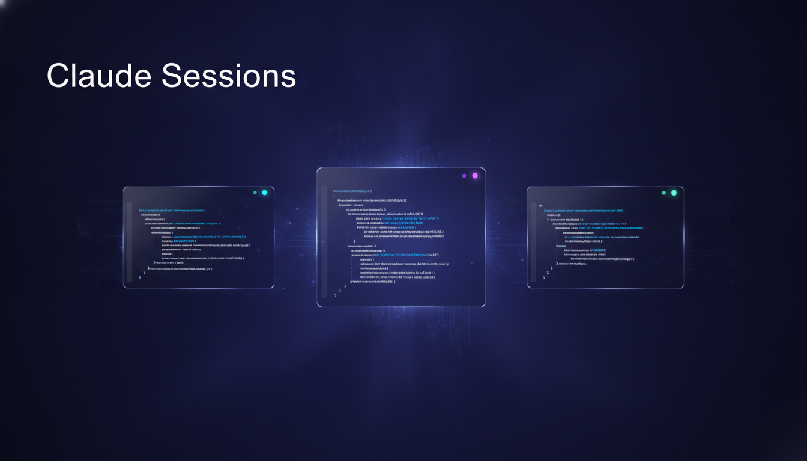
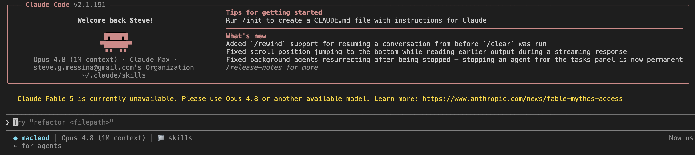

<div align="center">



[](LICENSE)


</div>

# Claude Sessions

Run several **Claude Code** accounts on one machine — isolated credentials,
distinct footers, and shared-plus-local memory — via the
`claude-config-bootstrap` skill in this repo.

One command — `claude-session` — installs the skill and bootstraps your
clients. No copying zips, no exporting environment variables by hand. Replace
`macleod` / `clientA` / `clientB` with your real client names.

---

## Quick start

```bash
git clone <this-repo> claude-sessions
cd claude-sessions
./claude-session --create macleod clientA clientB
source ~/.zshrc   # one time only — see note below
```

That's it. `--create` copies the skill into `~/.claude/skills/`, installs a
global `claude-session` command, and for each client creates its config dir,
memory, statusline, and a `cc-<client>` launcher. The first launch logs that
account in:

```bash
cc-macleod
```

Each client runs in its own terminal. Launch as many at once as you like:

```bash
cc-macleod
cc-clientA
cc-clientB
```

A bare `claude` is disabled on purpose so you can't start an unlabeled session
against the wrong account. To bypass it deliberately:

```bash
command claude
```

> **The one-time `source`.** A script can't reload its parent shell, so the
> *first* run needs `source ~/.zshrc` (or a new terminal). After that,
> `claude-session` is installed as a shell function — available in every
> terminal and **auto-reloading your shell** after each run, so you never type
> `source` again.

<p align="center">
  
</p>
---

## Managing clients

`claude-session` is global after first install — run it from anywhere:

```bash
claude-session --create newclient   # add one or more clients
claude-session --list               # list configured clients
claude-session --delete clientA     # remove one or more clients (prompts first)
```

Every subcommand is idempotent and refreshes the launchers from the live set of
clients (the shell reloads automatically).

### Removing everything

```bash
claude-session --revert          # remove tooling, keep account dirs
claude-session --revert --force  # also delete every account dir
```

`--revert` removes the rc launcher block (restoring a normal bare `claude`), the
global command, and `~/.claude-shared`. By default your `~/.claude-clients/*`
account dirs are kept and reported (they hold real logins/history); add
`--force` to delete those too. Add `-y`/`--yes` to skip confirmation prompts.

---

## Editing memory

| Want to change… | Edit this file |
|---|---|
| Shared rules (all clients) | `~/.claude-shared/global.md` |
| One client's rules | `~/.claude-clients/<client>/CLAUDE.md` — add lines **below** the `:end` marker |
| One project's rules | `CLAUDE.md` in that repo |

Never edit between the `:begin` / `:end` markers — that block is auto-managed.

---

## Check it's working

Inside a session:

- `/memory` → should list `global.md` (the shared import is loading)
- Look at the footer → shows the client name (e.g. `● macleod`)

If the footer is blank or wrong, quit and relaunch with `cc-<client>`.

---

## Troubleshooting

| Problem | Fix |
|---|---|
| `cc-macleod: command not found` | `source ~/.zshrc` (or open a new terminal) |
| Footer shows `⚪ DEFAULT` | You didn't use a `cc-` command. Quit, relaunch with `cc-<client>`. |
| Footer missing model/folder | Install jq: `brew install jq` |
| Footer didn't change after setup | Quit Claude and relaunch with `cc-<client>` |

---

## How it works

`claude-session` (repo root) owns the shell integration — the `cc-<client>`
launchers, the bare-`claude` guard, and the global, auto-sourcing
`claude-session` command — and delegates per-client memory + statusline config
to the skill's `setup.sh`. The skill ships as plain files under
`claude-config-bootstrap/` (`SKILL.md`, `README.md`, `scripts/setup.sh`);
`--create` copies that folder into `~/.claude/skills/` so Claude Code can also
trigger it by name. `setup.sh` is idempotent and self-contained. For the full
design, flags, and mechanics, read
[`claude-config-bootstrap/README.md`](claude-config-bootstrap/README.md).

---

## License

[MIT](LICENSE) © 2026 Macleod Labs https://macleodlabs.ai 
